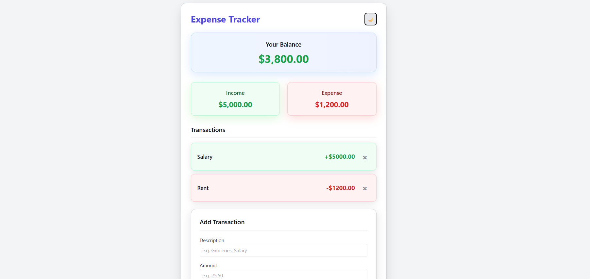
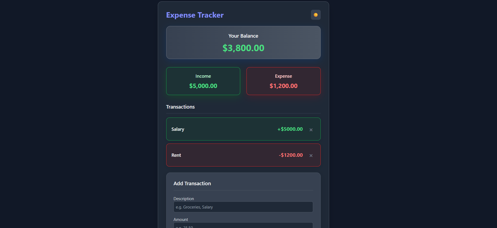

# Expense Tracker 💰

A modern, responsive expense tracking application built with React and Tailwind CSS. Features dark/light mode, local storage persistence, and beautiful UI animations.


## ✨ Features

- 💰 **Income & Expense Tracking** - Add, view, and delete transactions
- 🌙 **Dark/Light Mode** - Toggle between themes with system preference detection
- 💾 **Local Storage** - Data persists between sessions
- 📱 **Fully Responsive** - Works perfectly on desktop, tablet, and mobile
- 🎨 **Modern UI** - Beautiful design with smooth animations and shadows
- 🗑️ **Easy Deletion** - Remove transactions with one click
- ⚡ **Fast Performance** - Built with Vite for optimal speed

## 🚀 Live Demo

[](https://your-vercel-link.vercel.app)

## 🛠️ Tech Stack

- **Frontend:** React 19, Tailwind CSS 4
- **Build Tool:** Vite
- **Storage:** Browser Local Storage
- **Deployment:** Vercel

## 📦 Installation

1. Clone the repository
```bash
git clone https://github.com/montesinodev/expense-tracker.git
```

2. Install dependencies
```bash
npm install
```

3. Start the development server
```bash
npm run dev
```

4. Open http://localhost:5173 in your browser

## 🎯 Usage  
- **Add Transactions:** Enter description, amount, and type (income/expense) 

- **View Summary:** See your balance, total income, and total expenses 

- **Toggle Theme:** Switch between light and dark mode 

- **Manage Data:** All data automatically saves to local storage 

📸 Screenshots

### Light Mode


### Dark Mode


🏗️ Project Structure

```text
src/
├── components/
│   ├── Header.jsx
│   ├── Balance.jsx
│   ├── IncomeExpenseSummary.jsx
│   ├── TransactionList.jsx
│   ├── TransactionItem.jsx
│   ├── AddTransactionForm.jsx
│   └── DarkModeToggle.jsx
├── App.jsx
├── main.jsx
└── index.css
```

🌟 Why This Project?  

This project demonstrates:

* Modern React development with hooks

* Responsive UI design with Tailwind CSS

* Dark mode implementation

* Local storage usage for data persistence

* Clean component architecture

* Professional deployment practices


🤝 Contributing

Contributions, issues, and feature requests are welcome! Feel free to check issues page.

⭐ Star this repo if you found it helpful!


